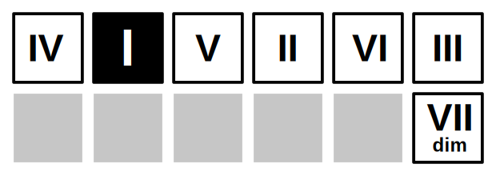
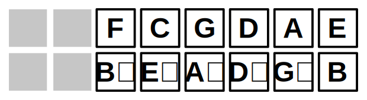

# Recommended Layout

The layout of the Nanopad 2 (and the original Nanopad) can be edited using the
[Korg Kontrol
Editor](https://www.korg.com/us/support/download/software/1/253/1354/). To use
this project, your pad should have:

1. An X/Y pad that sends mod wheel input for its Y axis.
2. At least one drum pad for each note in an octave.

On the first point, my suggestion is that you set the Y axis of the X/Y pad to
the mod wheel and set the X axis to do nothing (instead of the default pitch
bend). This will greatly reduce the volume of MIDI messages that have to be
ignored.

On the second point, as long as you have a pad that's associated with each of
the 12 distinct notes in an octave, you'll be able to play any key and chord.
However, there is a recommended layout that makes it easier to consistently play
chord progressions.

If you use one of the default "scenes" in which notes are arranged in order from
low to high, the pattern of chords will be different for each key, which makes
it difficult to remember chord progressions.

By arranging 12 of the pads in a circle of fifths, the pattern of chords stays
consistent, although it does rotate. Starting from the root chord of the key,
one pad counterclockwise and five pads clockwise can all be used to trigger
chords that are part of of the key.  The progression is illustrated here:

The recommended tuning for a nanopad 1 is:

Because the nanopad 2 has 16 pads, the recommended tuning disables four pads:

This repository includes three configuration files that can be used with the Korg Kontrol Editor to configure a Nanopad 2:

* [`pico-cheatar.nanopad2_glob`](nanopad2/pico-cheatar.nanopad2_glob): Global
  configuration settings (for the X/Y pad).
* [`pico-cheatar.nanopad2_set`](nanopad2/pico-cheatar.nanopad2_set): A "scene
  set" to tune all "scenes" to the recommended tuning.
* [`pico-cheatar.nanopad2_data`](nanopad2/pico-cheatar.nanopad2_data): Settings
  to update a single scene to the recommended tuning.

If you have a Nanopad 1 and would like to contribute configuration files, please
[create a ticket](https://github.com/duhrer/pico-cheatar/issues).
